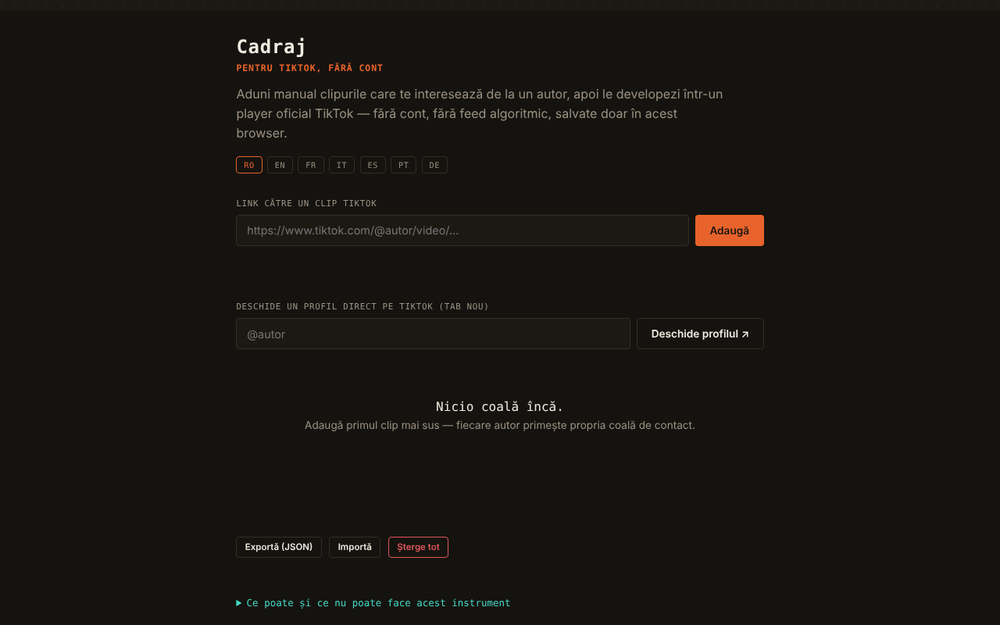

# Cadraj

Cadraj — pentru TikTok, fără cont: o „coală de contact" personală pentru clipuri TikTok adăugate manual.

**Live:** https://chiuta.github.io/Cadraj/

## Ce este

Cadraj este o aplicație dintr-un singur fișier HTML în care adaugi manual linkuri către clipuri TikTok ale unui autor, iar aplicația le grupează pe colecții (câte una pe autor) și le afișează prin playerul oficial de embed TikTok, fără cont și fără feed algoritmic. Aplicația spune explicit ce nu face: nu enumeră automat clipurile unui profil, nu ocolește protecțiile TikTok și nu descarcă fișiere video.

## Funcții

- Adăugare clip după link (`https://www.tiktok.com/@autor/video/...`), cu mesaj de stare.
- Colecții pe autor, cu notiță text pentru fiecare clip.
- Deschiderea unui profil TikTok într-un tab nou (câmpul „@autor", butonul „Deschide profilul ↗").
- Căutare în colecții (după autor sau cuvinte din notițe).
- Vizualizare mărită (lightbox) cu navigare ‹ / ›, tastele Săgeată stânga / Săgeată dreapta și Escape pentru închidere.
- Export și import al colecției ca fișier JSON; „Șterge tot".
- Interfață în 7 limbi: RO, EN, FR, IT, ES, PT, DE.

## Manual de utilizare

1. Alege limba din butoanele RO / EN / FR / IT / ES / PT / DE.
2. Dacă vrei să găsești clipuri, scrie „@autor" în câmpul de profil și apasă „Deschide profilul ↗"; profilul se deschide pe TikTok, într-un tab separat.
3. Copiază linkul unui clip, lipește-l în câmpul „Link către un clip TikTok" și apasă „Adaugă".
4. Clipul apare în colecția autorului; poți scrie o notiță sub el (Enter confirmă).
5. Apasă pe un clip pentru a-l deschide în player; navighezi cu ‹ › sau cu săgețile de la tastatură, închizi cu ✕ sau Escape.
6. Folosește „Caută în colecții" pentru a filtra.
7. „Exportă (JSON)" salvează colecția într-un fișier; „Importă" o încarcă înapoi; „Șterge tot" golește colecția.

## Confidențialitate și rețea

- Local: colecția (linkurile și notițele) se păstrează în `localStorage` al browserului, sub cheia `tiktok-fara-cont:v1`. Nu există cont și nici server propriu al aplicației; în codul verificat nu există apeluri `fetch`.
- Rețea: aplicația nu este complet offline. La vizualizarea unui clip se încarcă în iframe playerul oficial `https://www.tiktok.com/player/v1/<id>`, deci TikTok primește cererea (și poate aplica propriile cookie-uri/politici). Butonul de profil și linkurile către clipuri deschid `www.tiktok.com`. Nu sunt alte gazde terțe în cod.
- Textul din aplicație afirmă „fără cont · fără telemetrie · fără server", valabil pentru aplicația în sine, nu pentru playerul TikTok încărcat în iframe.

## Rulare locală / offline

Descarcă `index.html` și deschide-l în browser. Colecția și interfața funcționează local; redarea clipurilor și deschiderea profilurilor necesită internet.

## Licență

Licența nu este încă declarată explicit în acest repository; vezi nota din aplicație.

## Autor

Alexio — Alexandru-Ionuț Chiuță, contact: alexio@trom.tf

## English summary

Cadraj is a single-file HTML tool for building a personal contact sheet of TikTok clips you add manually by link, grouped per author, played through TikTok's official embed player, with notes, search, lightbox, and JSON export/import. Data stays in localStorage; playback loads tiktok.com in an iframe, so it needs internet. 7 UI languages. It does not scrape profiles or download videos.
